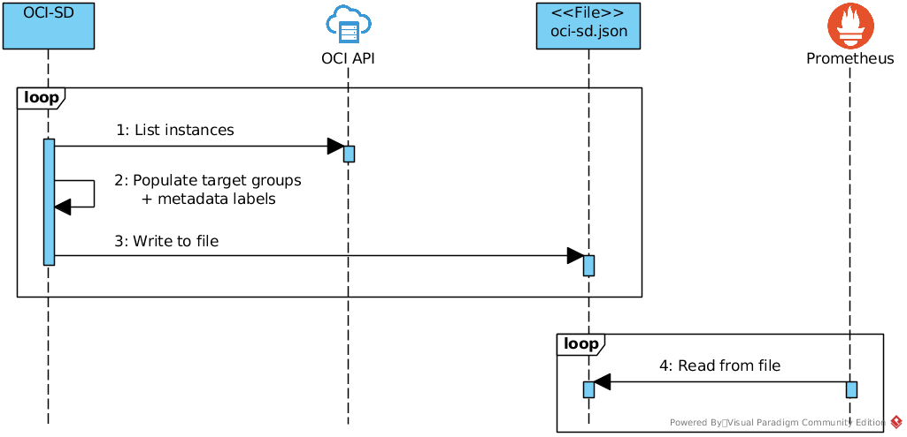

# OCI Service Discovery

[](https://travis-ci.org/sw-samuraj/oci-sd)
[](https://github.com/sw-samuraj/oci-sd)
[](https://godoc.org/github.com/sw-samuraj/oci-sd/oci)
[](https://bestpractices.coreinfrastructure.org/projects/2185)

[Prometheus](https://github.com/prometheus/prometheus) service discovery for OCI ([Oracle Cloud Infrastructure](https://cloud.oracle.com/iaas)).

## How it works

Unfortunately, _Prometheus_ team [doesn't accept new service discovery
integrations](https://github.com/prometheus/prometheus/issues/4322#issuecomment-401828508) in the _Prometheus_
code base. Instead, they propose to use [file
SD](https://prometheus.io/docs/prometheus/latest/configuration/configuration/#%3Cfile_sd_config%3E) integration.
Therefore, _OCI Service Discovery_ works in following manner:



As should be obvious from the diagram, synchronization of monitored targets (i.e. OCI instances) happens via shared
`oci-sd.json` file (the file name can be arbitrary):

1. _OCI-SD_ periodically provides this file
1. _Prometheus_ periodically consumes it.

Please note, that those discoveries/scrapings are independent of each other.

## How to use it

OCI-SD can be used in two ways: either as a standalone, CLI application, or as a _Golang_ package which can
be imported to your application.

### A standalone application

You can build and run a command line application `oci-sd`. Once properly configured (see the
[Configuration](#oci-sd-configuration) section), the application starts to query OCI for list of instances
and write those to the `oci-sd.json` file.

You can run the application with default values for configuration and output files:

    ./bin/oci-sd

Or you can provide specific values via command-line flags:

    ./bin/oci-sd -c conf/oci-sd.toml -o conf/prometheus-sd.json

See an [Example](#example) section for a practical example and tutorial.

### Golang package

If you don't want to have a separate standalone application for service discovery, you can include the `oci`
(and probably the `adapter`) package(s) into your application.

Here is an example usage:

```go
ociConfig := oci.SDConfig{
    // populate the config
}
logger := logrus.StandardLogger()

disc, err := oci.NewDiscovery(&ociConfig, logger)
if err != nil {
    logger.WithFields(logrus.Fields{"func": "main", "err": err}).Fatal("can't create OCI discovery")
}

sdOutputFile := "oci-sd.json"
adapter = adapter.NewAdapter(ctx, sdOutputFile, "ociSD", disc, *logger)
adapter.Run()
```

## How to build a standalone application

Prerequisites for build of `oci-sd` as a standalone application is `go1.11`+ and `make`:

    make build

## OCI-SD configuration

### Command line flags

You can run `oci-sd --help` to see command line configuration flags:

    $ ./bin/oci-sd --help
    Usage of ./bin/oci-sd:
      -c, --config-file string   external config file (default "oci-sd.toml")
      -o, --output-file string   output file for file_sd compatible file (default "oci-sd.json")

### Configuration file

The configuration file (e.g. `oci-sd.toml`) should contain following mandatory values:

```toml
[SDConfig]
User = "ocid1.user.1"
FingerPrint = "42:42:42"
KeyFile = "/home/user/.oci/oci_api_key.pem"
PassPhrase = "secret"
Tenancy = "ocid1.tenancy.1"
Region = "us-phoenix-1"
Compartment = "ocid1.compartment.1"
```

Additionally, there can be following optional values:

```toml
Port = 4242               # default port is 9100
RefreshInterval = "120s"  # default interval is 60 seconds
```

## Prometheus configuration

Here is _Prometheus_ configuration for the file based service discovery:

```yaml
scrape_configs:
  - job_name: 'oci-sd'
    scrape_interval: 5s
    file_sd_configs:
    - files:
      - oci-sd.json
      refresh_interval: 1m
    relabel_configs:
    - source_labels: ['__meta_oci_public_ip']
      target_label: '__address__'
      replacement: '${1}:9100'
```

## Metadata labels

The following meta-labels are available on targets during re-labeling:

* `__meta_oci_availability_domain`: the availability domain in which the instance is running
* `__meta_oci_compartment_id`: OCID of the used compartment
* `__meta_oci_defined_tag_<namespace>_<tagkey>`: each defined tag value of the instance
* `__meta_oci_freeform_tag_<tagkey>`: each freeform tag value of the instance
* `__meta_oci_instance_id`: OCID of the instance
* `__meta_oci_instance_name`: the name of the instance
* `__meta_oci_instance_state`: the state of the instance
* `__meta_oci_private_ip`: the private IP address of the instance
* `__meta_oci_public_ip`: the public IP address of the instance, if available

## Example

You can find an example for standalone application in the [example](example) directory. It contains:

* `oci-sd` configuration file.
* [Terraform](//www.terraform.io/) scripts which create 3 OCI instances with running
  [node_exporter](//github.com/prometheus/node_exporter)s.
* _Prometheus_ configuration file with pre-configured `file_sd` scrape config and `oci-sd` specific re-labeling.

See [example/README.md](example/README.md) file for more details.

## License

The **oci-sd** application and the **oci** package are published under
[BSD 3-Clause](http://opensource.org/licenses/BSD-3-Clause) license.

The **adapter** package is published under [Apache 2.0](http://www.apache.org/licenses/LICENSE-2.0) license.
