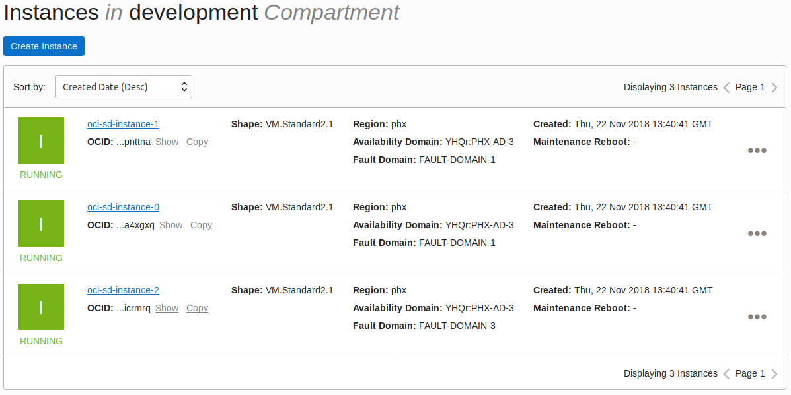
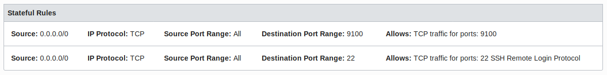
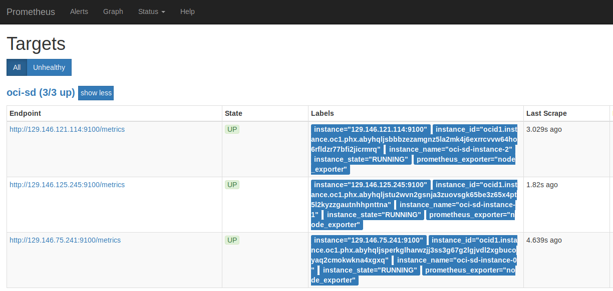

# OCI-SD Example

This example/tutorial shows how to:

* start 3 testing OCI instances,
* configure and run a standalone `oci-sd` application,
* start _Prometheus_ with `file_sd` configuration.

## Testing OCI instances

**Prerequisities:** [Terraform](//www.terraform.io/)

1. `cd example/terraform`
1. Edit `env-vars` that it contains proper values for your OCI tenancy (see
   [CLI Configuration Information](https://docs.cloud.oracle.com/iaas/Content/API/Concepts/sdkconfig.htm)).
1. `. env-vars`
1. `terraform init`
1. `terraform plan`
1. `terraform apply -auto-approve`

You should see 3 instances in your _OCI Console_:

These instances have running `node_exporter`s on the `9100` port. As you can can see on following screenshot,
this port is open in the configured _security list_:

You can check that everything is fine via `curl`:

    curl <public-ip-of-your-instance>:9100/metrics

If you see something like following (abridged) output, you are ready for service discovery.

    # HELP go_gc_duration_seconds A summary of the GC invocation durations.
    # TYPE go_gc_duration_seconds summary
    go_gc_duration_seconds{quantile="0"} 2.5834e-05
    go_gc_duration_seconds{quantile="0.25"} 5.6118e-05
    go_gc_duration_seconds{quantile="0.5"} 6.008e-05
    go_gc_duration_seconds{quantile="0.75"} 6.812e-05
    go_gc_duration_seconds{quantile="1"} 0.000120973
    go_gc_duration_seconds_sum 0.118491416
    go_gc_duration_seconds_count 1997

## oci-sd

**Prerequisities:** `oci-sd` binary

1. Edit `example/conf/oci-sd.toml` that it contains proper values for your OCI tenancy (see
   [CLI Configuration Information](https://docs.cloud.oracle.com/iaas/Content/API/Concepts/sdkconfig.htm)).
1. `./bin/oci-sd -c example/conf/oci-sd.toml -o example/prometheus/oci-sd.json`

## Prometheus

**Prerequisities:** [Prometheus](//prometheus.io/)

1. `./prometheus --config.file=<path-to-oci-sd-directory>/example/prometheus/prometheus.yml`
1. Based on the configured refresh interval, check the `example/prometheus/oci-sd.json` file if it was populated
   with (OCI instances) targets.
1. Check _Service Discovery_ console: http://localhost:9090/service-discovery
1. Check _Targets_ console: http://localhost:9090/targets

